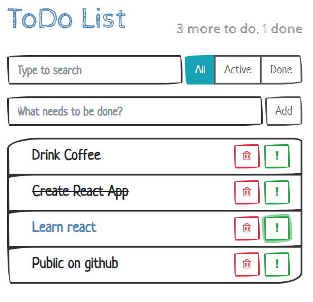
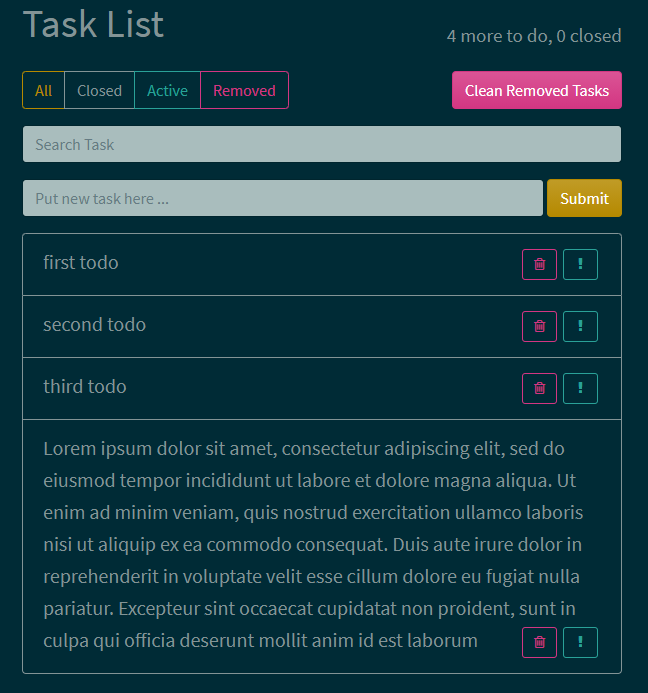
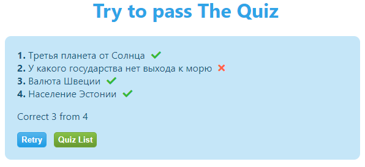
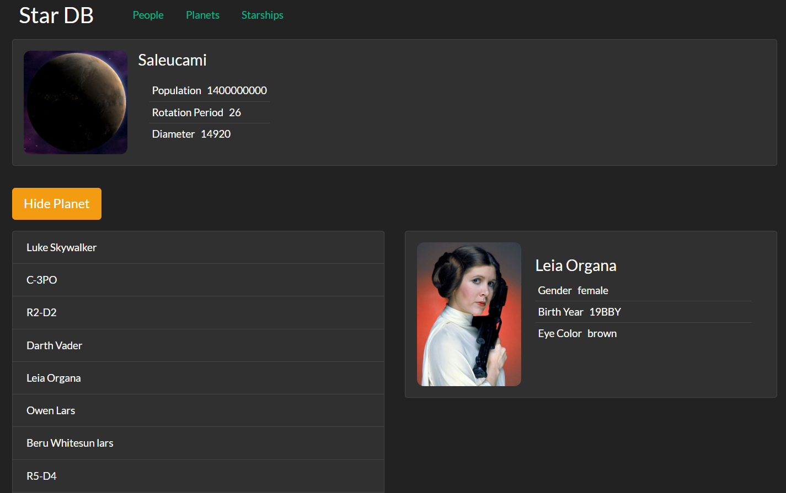
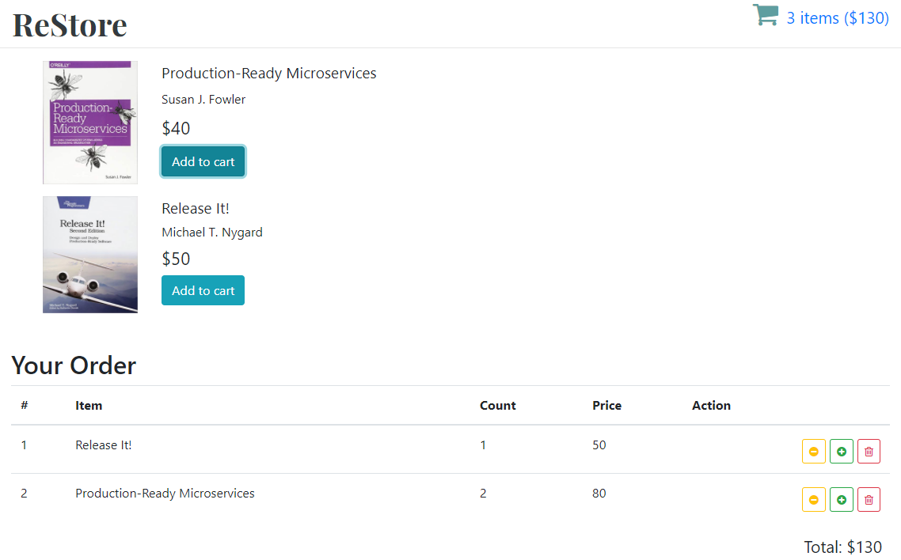
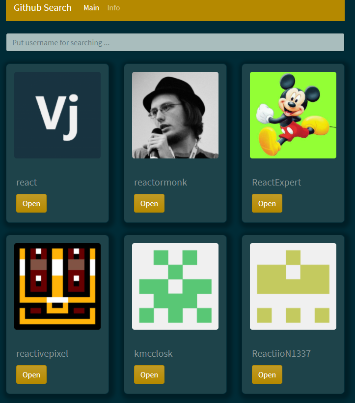

# React Projects

I've create this application for practice some new frameworks and libraries:

React / Hooks / Router / Redux/ useContext / ueeReducer / Firebase / REST API/ PropTypes

All projects deployed with *netlify*.

**Contents:**

- [React Projects](#react-projects)
  - [toDo List Application (Class Components)](#todo-list-application-class-components)
  - [todo-hooks Application (hooks)](#todo-hooks-application-hooks)
  - [Quiz Application (Redux / Firebase)](#quiz-application-redux--firebase)
  - [Star Wars Database Application (Class Components / Router / REST API)](#star-wars-database-application-class-components--router--rest-api)
  - [re-store (Redux)](#re-store-redux)
  - [fish-store (hooks / firebase)](#fish-store-hooks--firebase)
  - [github-search (hooks / REST API)](#github-search-hooks--rest-api)
  - [redux structure](#redux-structure)
## toDo List Application (Class Components)

[More information about application](./to-do/README.md)

## todo-hooks Application (hooks)

[More information about application](./todo-hooks/README.md)

## Quiz Application (Redux / Firebase)
[More information about application](./quiz/README.md)

## Star Wars Database Application (Class Components / Router / REST API)

[More information about application](./star-wars-database-api/README.md)

## re-store (Redux)

[More information about application](./re-store/README.md)

## fish-store (hooks / firebase)

In Progress
## github-search (hooks / REST API)

[More information about application](./github-search/README.md)

## redux structure

Main redux structure could be found in one [script](.\redux.js)

Worked example of redux small application with async function could be found in small test [application](./counter/README.md)
