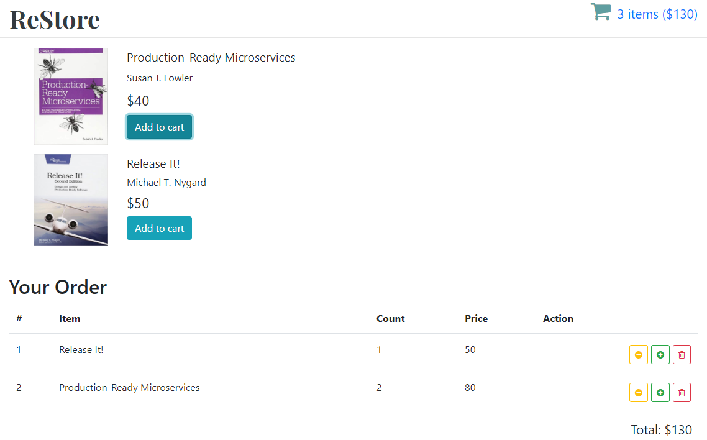

# re-store

I've create this application for practice some new frameworks and libraries.

There are next features in this application:
- this application based on **React**;
- **React-Router** was used for jumping between pages;
- **Redux** were used for manage state;
- **DUMMY_DATA** was used like database;

## Last Deploy

[Site](https://6012764fca3ddea707419b09--redux-book-store.netlify.app)